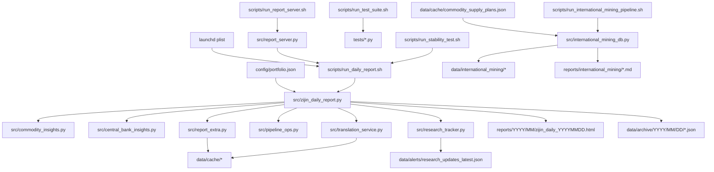
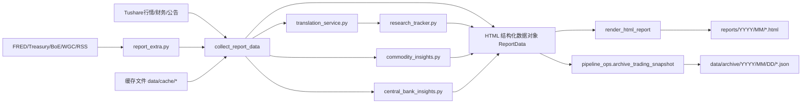

# 紫金矿业日报系统总览

> 说明：本文档描述的是仓库中的历史“紫金日报”模块，不属于当前 rolling-snowball 控制台主线。

## 1. 系统定位

紫金矿业日报系统是一个以 `Python + pandas + Tushare` 为核心的配置驱动型研究自动化项目。系统围绕“紫金矿业持仓跟踪”构建，完成以下闭环：

1. 拉取行情、财务、公告、宏观与外部研究数据。
2. 对黄金、铜、锂、美元与美债、央行购金、国际矿企等主题做结构化分析。
3. 将结果拼装为面向业务读者的 HTML 日报。
4. 在交易时段执行小时级更新，在收盘后执行归档。
5. 通过本地 HTTP 服务提供“最新报告浏览 + 手动刷新”能力。

## 2. 项目目录树

```text
rolling-snowball/
├── README.md
├── requirements.txt
├── .env
├── .env.example
├── config/
│   └── portfolio.json
├── src/
│   ├── zijin_daily_report.py
│   ├── pipeline_ops.py
│   ├── report_extra.py
│   ├── report_server.py
│   ├── translation_service.py
│   ├── research_tracker.py
│   ├── commodity_insights.py
│   ├── central_bank_insights.py
│   └── international_mining_db.py
├── scripts/
│   ├── run_daily_report.sh
│   ├── run_report_server.sh
│   ├── run_test_suite.sh
│   ├── run_stability_test.sh
│   └── run_international_mining_pipeline.sh
├── launchd/
│   └── com.user.zijin-daily-report.plist.example
├── tests/
│   ├── test_zijin_daily_report.py
│   ├── test_pipeline_ops.py
│   ├── test_pipeline_integration.py
│   ├── test_report_extra.py
│   ├── test_report_server.py
│   ├── test_translation_service.py
│   ├── test_research_tracker.py
│   ├── test_commodity_insights.py
│   ├── test_central_bank_insights.py
│   └── test_international_mining_db.py
├── data/
│   ├── cache/
│   │   ├── commodity_supply_plans.json
│   │   ├── research_entries.json
│   │   ├── policy_events.json
│   │   ├── central_bank_gold.json
│   │   ├── dollar_index_proxy.csv
│   │   ├── research_tracking_state.json
│   │   └── translations/
│   │       ├── gold_entries.json
│   │       ├── policy_entries.json
│   │       └── research_entries.json
│   ├── alerts/
│   │   └── research_updates_latest.json
│   ├── archive/
│   │   └── YYYY/MM/DD/
│   │       ├── trading_snapshot_YYYYMMDD.json
│   │       └── trading_snapshot_YYYYMMDD.manifest.json
│   └── international_mining/
│       ├── international_mining_companies.db
│       ├── international_mining_analysis_summary.json
│       ├── raw_data_inventory.csv
│       ├── raw_supply_records.csv
│       ├── raw_supply_records.json
│       ├── standardized_company_dimensions.csv
│       └── standardized_production_guidance.csv
├── reports/
│   ├── YYYY/MM/
│   │   ├── zijin_daily_YYYYMMDD.html
│   │   └── zijin_daily_YYYYMMDD.md
│   ├── international_mining/
│   │   ├── 国际矿企多维分析报告.md
│   │   └── 国际矿企数据库使用说明.md
│   ├── testing/
│   │   ├── TEST_REPORT_20260705.md
│   │   └── stability_*.log
│   └── validation_3day/
│       └── zijin_daily_20260704.html
└── docs/
    └── ai_context/
        ├── README.md
        ├── 01_system_overview.md
        ├── 02_module_registry.md
        ├── 03_operations_maintenance.md
        └── 04_retrieval_validation.md
```

## 3. 代码资产盘点

| 路径 | 类型 | 核心职责 | 上游依赖 | 下游产物 |
| --- | --- | --- | --- | --- |
| `config/portfolio.json` | 配置 | 持仓参数、观察标的、外部源缓存路径、分析逻辑 | 无 | 被主程序和分析模块读取 |
| `src/zijin_daily_report.py` | 主程序 | 配置加载、数据采集编排、分析拼装、HTML 渲染、调度入口 | `portfolio.json`、Tushare、外部模块 | HTML 日报、归档数据 |
| `src/pipeline_ops.py` | 工具模块 | 交易日判断、归档序列化、完整性校验 | `ReportData` 数据对象 | `data/archive` 快照与 manifest |
| `src/report_extra.py` | 外部抓取模块 | FRED、美债、BoE、央行政策、WGC 等外部抓取与缓存去重 | 网络数据源 | DataFrame、结构化记录 |
| `src/report_server.py` | 本地服务 | 提供最新 HTML、健康检查、刷新日报 | `scripts/run_daily_report.sh` | 本地 HTTP 接口 |
| `src/translation_service.py` | 翻译模块 | 术语表、OpenAI 兼容接口、翻译缓存、失败告警 | `.env`、翻译服务 | 翻译后的记录与告警文件 |
| `src/research_tracker.py` | 研报模块 | 主题分类、可信度标注、增量更新跟踪 | 翻译后的研报/资讯 | `research_updates_latest.json` |
| `src/commodity_insights.py` | 商品分析模块 | 金铜锂价格、供给、收入结构、收入预测 | 行情数据、供给事实库、财务数据 | 商品分析结构体 |
| `src/central_bank_insights.py` | 央行购金模块 | 解析 WGC 购金记录、国家维度汇总、价格联动 | WGC 条目、黄金价格 | 央行购金分析结构体 |
| `src/international_mining_db.py` | 国际矿企管道 | 产量口径标准化、SQLite 写库、专题报告生成 | `commodity_supply_plans.json` | `data/international_mining`、专题报告 |
| `scripts/run_daily_report.sh` | 运行脚本 | 加载 `.env` 并执行日报主程序 | `.env`、主程序 | 每日日报 |
| `scripts/run_report_server.sh` | 运行脚本 | 启动本地服务 | `report_server.py` | 8765 本地服务 |
| `scripts/run_test_suite.sh` | 测试脚本 | 执行 `unittest` 测试集 | `tests/` | 控制台测试结果 |
| `scripts/run_stability_test.sh` | 运维脚本 | 反复运行 scheduled 模式验证稳定性 | 日报主脚本 | `reports/testing/stability_*.log` |
| `scripts/run_international_mining_pipeline.sh` | 数据脚本 | 执行国际矿企标准化流水线 | `international_mining_db.py` | 数据库、CSV、Markdown |
| `launchd/com.user.zijin-daily-report.plist.example` | 调度配置 | macOS 定时调度模板 | 脚本 | 自动小时级执行 |
| `tests/*.py` | 测试 | 为主程序、外部抓取、服务、分析、归档模块提供回归保障 | 源码模块 | 回归验证结果 |

## 4. 运行模式

| 模式 | 入口 | 典型命令 | 说明 |
| --- | --- | --- | --- |
| 手工生成日报 | `scripts/run_daily_report.sh` | `bash scripts/run_daily_report.sh` | 立即执行一次完整日报生成 |
| 调度模式 | `scripts/run_daily_report.sh --mode scheduled` | `bash scripts/run_daily_report.sh --mode scheduled` | 按交易日和时间窗口决定是否更新或归档 |
| 强制刷新 | `report_server.py` 内部调用 | `POST /api/refresh-report` | 无视调度窗口，立即重跑生成 |
| 本地预览服务 | `scripts/run_report_server.sh` | `bash scripts/run_report_server.sh` | 浏览最新 HTML，支持手动刷新 |
| 单元测试 | `scripts/run_test_suite.sh` | `bash scripts/run_test_suite.sh` | 跑全量 `unittest` |
| 稳定性测试 | `scripts/run_stability_test.sh` | `bash scripts/run_stability_test.sh 72 3600` | 72 小时循环执行 scheduled 模式 |
| 国际矿企流水线 | `scripts/run_international_mining_pipeline.sh` | `bash scripts/run_international_mining_pipeline.sh` | 更新国际矿企标准化数据集与专题报告 |

## 5. 模块依赖图谱



## 6. 全局业务链路

### 6.1 日报主链路

1. `scripts/run_daily_report.sh` 加载 `.env`。
2. `src/zijin_daily_report.py` 解析参数并加载 `config/portfolio.json`。
3. 主程序通过 `TushareFetcher` 抓取行情、财务、公告、新闻、交易日历等。
4. 主程序通过 `report_extra.py` 抓取 FRED、美债、BoE、Fed/BoJ/BoE 政策、WGC 等外部数据。
5. 如启用翻译，研究/政策/央行购金等条目经 `translation_service.py` 做翻译缓存和术语修正。
6. 研报条目再经 `research_tracker.py` 做主题分类、可信度标记和增量告警。
7. 商品、央行购金、国际矿企、多资产等分析由专门函数或分析模块生成结构化结果。
8. `render_html_report()` 将所有结构化结果渲染为 HTML。
9. `save_report()` 将结果写入 `reports/YYYY/MM/`。
10. 若调度模式命中收盘后窗口，`pipeline_ops.py` 将 `ReportData` 序列化归档到 `data/archive/YYYY/MM/DD/`。

### 6.2 国际矿企专题链路

1. 人工维护 `data/cache/commodity_supply_plans.json`。
2. `src/international_mining_db.py` 读取事实库并去重。
3. 对金、铜、锂三类产量进行单位识别、标准化、状态标记和规模分层。
4. 将结果写入 SQLite、CSV 和 JSON。
5. 生成专题 Markdown 报告与数据库使用说明。
6. 日报主程序再读取这一事实库衍生内容，用于国际矿企对标板块。

## 7. 数据流转链路图



## 8. 数据域划分

| 业务域 | 核心内容 | 关键文件 |
| --- | --- | --- |
| 配置域 | 持仓参数、观察列表、外部源路径、分析规则 | `config/portfolio.json` |
| 市场行情域 | 紫金矿业、指数、外汇、期货、收益率 | `src/zijin_daily_report.py` |
| 外部研究域 | 研报、政策、央行购金、宏观附加数据 | `src/report_extra.py`、`src/translation_service.py`、`src/research_tracker.py` |
| 商品分析域 | 金铜锂价格、供给、营收、预测 | `src/commodity_insights.py` |
| 央行购金域 | WGC 数据纠偏、国家维度归因 | `src/central_bank_insights.py` |
| 国际矿企域 | 供给事实库、标准化数据库、专题分析 | `src/international_mining_db.py` |
| 渲染发布域 | HTML 拼装、本地浏览、手动刷新 | `src/zijin_daily_report.py`、`src/report_server.py` |
| 运维调度域 | 交易时段更新、收盘归档、稳定性测试 | `src/pipeline_ops.py`、`scripts/*.sh`、`launchd/*.plist.example` |

## 9. 关键产物

| 产物路径 | 说明 | 生成方 |
| --- | --- | --- |
| `reports/YYYY/MM/zijin_daily_YYYYMMDD.html` | 面向业务读者的正式日报 | `save_report()` |
| `reports/YYYY/MM/zijin_daily_YYYYMMDD.md` | 可选 Markdown 产物 | 现有报告目录中已存在 |
| `data/archive/YYYY/MM/DD/trading_snapshot_*.json` | 当日全量结构化快照 | `archive_trading_snapshot()` |
| `data/archive/YYYY/MM/DD/*.manifest.json` | 归档完整性清单 | `build_archive_manifest()` |
| `data/cache/*.json` | 外部抓取缓存、翻译缓存、研究状态 | `report_extra.py`、`translation_service.py`、`research_tracker.py` |
| `data/international_mining/*.db/csv/json` | 国际矿企标准化事实库 | `international_mining_db.py` |

## 10. AI 检索建议

- 查“日报主流程”时，优先检索 `collect_report_data`、`render_html_report`、`build_report`、`main`。
- 查“外部源抓取”时，优先检索 `fetch_fred_series`、`fetch_treasury_curve`、`fetch_goldhub_gold_purchase_entries`。
- 查“调度与归档”时，优先检索 `should_run_hourly_update`、`should_archive_after_close`、`archive_trading_snapshot`。
- 查“翻译与研报”时，优先检索 `translate_entries`、`filter_target_research`、`track_research_updates`。
- 查“国际矿企标准化”时，优先检索 `parse_production_text`、`standardize_mining_records`、`write_sqlite_database`。
